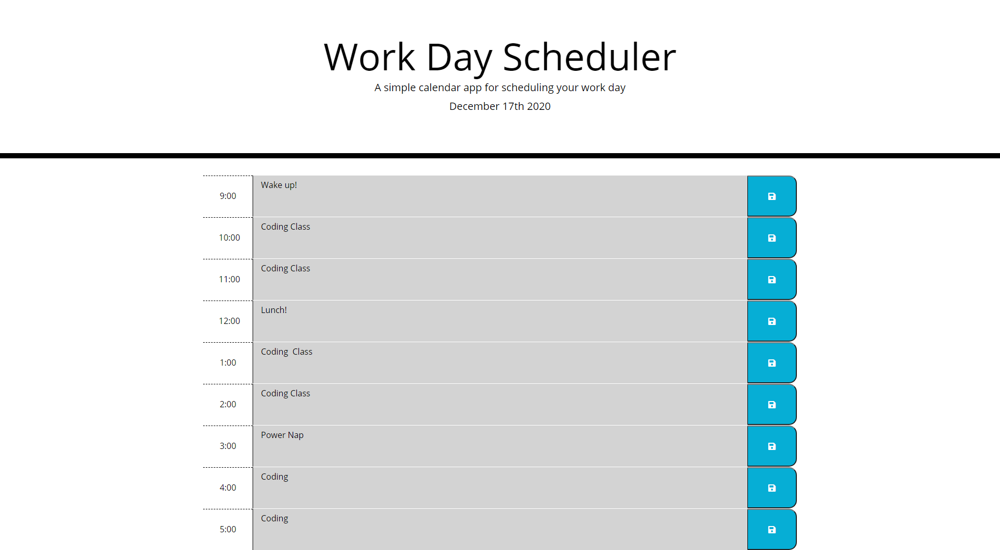

# Work Day Scheduler

## Description

The goal of this project was to create a webpage that functions as personal planner.  The user can edit in notes for the different work hours and they will persist even through reloading the page.  This project utilizes javascript and the Moment API to provide a dynamic color display according to the user's current time.

## Installation

All functionality of this project contained within the deployed webpage itself.  Users can navigate to the following address to experience the application:
https://pkeld148.github.io/work-day-scheduler/

## Usage

The user will be presented a series of text boxes which relate to the hour of the work day.  The user can edit in any messages or notes into these spaces.  Upon hitting any of the save buttons on the right side, the text in that corresponding space will be saved to local storage and will be visible in that space until manually deleted or edited over.

## Credits

The Georgia Tech Boot Camp provided the majority of the information needed to complete this project.

## License

Licensed under the [MIT](https://github.com/Pkeld148/work-day-scheduler/blob/main/LICENSE) license.